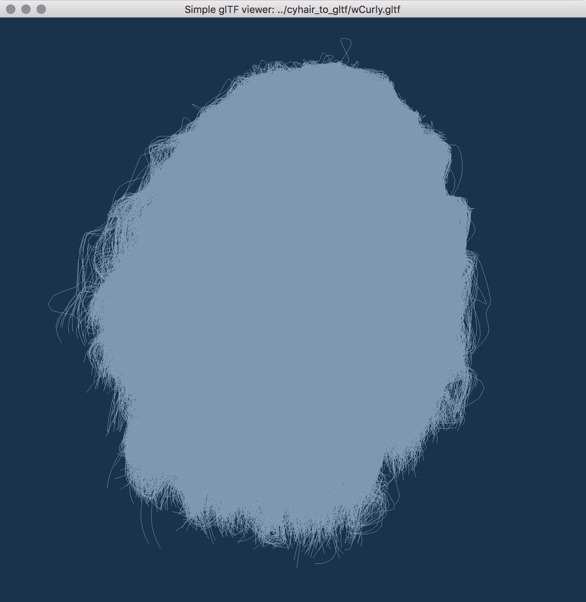

# Simple CyHair to glTF converter

For CyHair format, please refer: http://www.cemyuksel.com/cyCodeBase/code.html .

For hair model with CyHair format, please refer for example: http://www.cemyuksel.com/research/hairmodels/

## Convert

    $ ./cyhair2gltf input.hair output.gltf

## View

You can view converted .gltf with glviwew exmaple(`example/glview`).

